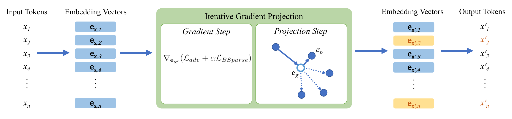

# Block-Sparse Adversarial Attack to Fool Transformer-Based Text Classifiers

This is the official repository of the paper **"Block-Sparse Adversarial Attack to Fool Transformer-Based Text Classifiers"**, the white-box adversarial attack against transformer-based text classifers. 



## Installation
Install [conda](https://conda.io) and run the steps below:
```
$ git clone https://github.com/sssadrizadeh/transformer-text-classifier-attack.git
$ cd transformer-text-classifier-attack
$ conda env create --file=env_attack.yml
$ conda activate text_attack
```

The datsets and models are available in the HuggingFace transformers package.

## Fine-tuning a pretrained model for classification
The source code to fine-tune GPT-2 model from HuggingFace for a classification task is available at [`./Classifier`](Classifier) folder. For example, to fine-tune GPT-2 moel on AG News dataset for news categorization, run:
```sh
$ python text_classification.py --dataset ag_news
```
After training, the fine-tuned model `gpt2_ag_news_finetune.pth` will be saved in the `result` folder.

## Performing adversarial attack against the finetuned model
To attack a finetuned model trained in the previous step, run the source code available at [`./Attack`](Attack):
```sh
$ python GradientProjectionAttack.py --start_index 100 --num_samples 200 --dataset ag_news
```
This code generates adversarial examples for the samples 100-300 of the AG News dataset. After running the code, a pickle file of the results are generated which can be evaluted by:
```sh
$ python EvaluateAttack.py --start_index 100 --num_samples 200 --dataset ag_news
```
This code evaluates the attack in terms of the average semantic similarity between the original sentences  and the adversarial ones by using Universal Sentence Encoder (USE), the token error rate, and the success attack rate.

**Acknowledgement:** Some parts of the codes are inspired by [GDBA](https://github.com/facebookresearch/text-adversarial-attack). We thank the authors for their valuable efforts. 

## Citation
If you found this repository helpful, please don't forget to cite our paper:
```BibTeX
@inproceedings{sadrizadeh2021gradient,
  title = {Block-Sparse Adversarial Attack to Fool Transformer-Based Text Classifiers},
  author = {Sahar Sadrizadeh, Ljiljana Dolamic, and Pascal Frossard},
  booktitle = {ICASSP 2022 IEEE International Conference on Acoustics, Speech and Signal Processing (ICASSP)},
  year = {2022}
}
```
In case of any question, please feel free to contact  [sahar.sadrizadeh@epfl.ch](mailto:sahar.sadrizadeh@epfl.ch).